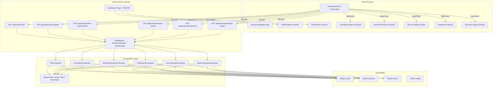
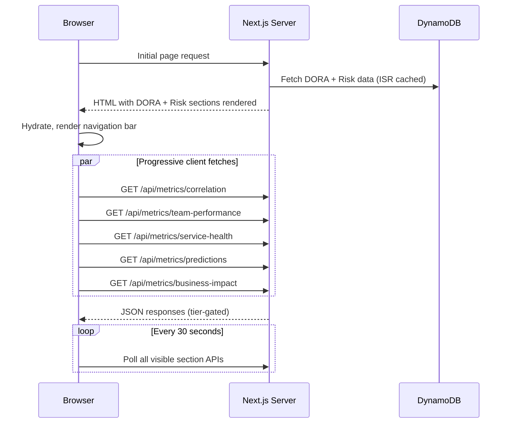

# Design Document: Advanced Dashboard Metrics

## Overview

This design extends the existing OllinAI dashboard with six new metric sections (Risk, Correlation, Team Performance, Service Health, Predictions & Prevention, Business Impact) served by dedicated API endpoints. The architecture preserves the current Next.js 14 App Router + ISR + client-side polling pattern while adding progressive loading for new sections to maintain fast initial paint.

Each metric section is backed by a computation layer that queries the existing DynamoDB tables (ollinai-events, ollinai-incidents, ollinai-metrics, ollinai-config) using established tenant-scoped access patterns. Tier-based access control gates advanced sections at both the API and UI layers using the existing `withTierGate` middleware.

### Key Design Decisions

1. **Compute-on-read with caching**: New metrics are computed on-the-fly from raw event/incident data rather than pre-aggregated, since the 3-second response target is achievable for ≤10,000 events. Results are cached with 30-second ISR.
2. **Progressive loading**: DORA + Risk render server-side; remaining sections load client-side after initial paint to avoid blocking LCP.
3. **Shared computation utilities**: Common patterns (trend calculation, filter application, insufficient-data checks) are extracted into reusable functions tested via property-based tests.
4. **Existing infrastructure**: No new DynamoDB tables or GSIs required — all data is queryable through existing key patterns and indexes.

## Architecture



### Loading Strategy



## Components and Interfaces

### API Route Handlers

Each endpoint follows the established pattern from `/api/metrics/dora/route.ts`:

```typescript
// src/app/api/metrics/risk/route.ts (pattern for all new endpoints)
import { NextRequest, NextResponse } from "next/server";
import { withAuthorization } from "@/lib/middleware/authorize";
import { withTierGate } from "@/lib/middleware/tier-gate";
import type { Feature } from "@/lib/tiers/tier-config";

// Feature-to-endpoint mapping for tier gating
const ENDPOINT_TIER_MAP: Record<string, Feature | null> = {
  risk: "risk_score",
  correlation: "incident_correlation",
  "team-performance": "risk_score",        // Pro+
  "service-health": "risk_score",           // Pro+
  predictions: "aiops_predictions",         // Enterprise
  "business-impact": "aiops_predictions",   // Enterprise
};
```

### Computation Layer

Located at `src/lib/metrics/computers/`:

```typescript
// src/lib/metrics/computers/types.ts
export interface MetricComputeContext {
  tenantId: string;
  from: Date;
  to: Date;
  teamId?: string;
  serviceId?: string;
}

export interface TrendIndicator {
  direction: "improving" | "degrading" | "stable";
  percentChange: number;
}

export interface InsufficientDataResult {
  type: "insufficient_data";
  eventCount: number;
  minimumRequired: 3;
}
```

### Shared Utility Functions

Located at `src/lib/metrics/utils/`:

```typescript
// src/lib/metrics/utils/trend.ts
export function computeTrendIndicator(
  current: number,
  previous: number,
  lowerIsBetter: boolean
): TrendIndicator;

// src/lib/metrics/utils/filters.ts
export function applyEventFilters(
  events: EventItem[],
  context: MetricComputeContext
): EventItem[];

// src/lib/metrics/utils/risk-score.ts
export const RISK_SCORE_NUMERIC: Record<string, number> = {
  low: 1, medium: 2, high: 3, critical: 4
};

export function computeAverageRiskScore(events: EventItem[]): number;

// src/lib/metrics/utils/time-grouping.ts
export function groupEventsByDay(
  events: EventItem[],
  from: Date,
  to: Date
): Map<string, EventItem[]>;
```

### Dashboard UI Components

Located at `src/app/dashboard/components/`:

```typescript
// Section wrapper with progressive loading
interface MetricSectionProps {
  id: string;
  title: string;
  apiEndpoint: string;
  tierRequired: Feature | null;
  currentTier: SubscriptionTier;
  timeRange: TimeRangeDays;
  filters: DashboardFilters;
}

// Section navigation bar
interface SectionNavBarProps {
  sections: Array<{ id: string; label: string; available: boolean }>;
  activeSection: string;
}

// Locked section state for tier-restricted content
interface LockedSectionProps {
  sectionName: string;
  requiredTier: SubscriptionTier;
  currentTier: SubscriptionTier;
}
```

## Data Models

### API Response Shapes

```typescript
// GET /api/metrics/risk
interface RiskMetricsResponse {
  distribution: { low: number; medium: number; high: number; critical: number };
  trend: Array<{ date: string; highCriticalCount: number }>;
  averageByService: Array<{
    serviceId: string;
    serviceName: string;
    averageScore: number;
    eventCount: number;
  }>;
  period: { start: string; end: string };
  filters: { team?: string; service?: string };
}

// GET /api/metrics/correlation
interface CorrelationMetricsResponse {
  correlationRate: number;                    // 0-100
  averageTimeToCorrelation: number;           // seconds
  uncorrelatedCount: number;
  correlationRateTrend: TrendIndicator;
  uncorrelatedTrend: TrendIndicator;
  period: { start: string; end: string };
  filters: { team?: string; service?: string };
  note?: string;                              // "No incidents in selected period"
}

// GET /api/metrics/team-performance
interface TeamPerformanceResponse {
  teams: Array<{
    teamId: string;
    teamName: string;
    changeFailureRate: number;
    deploymentFrequency: number;
    riskProfile: { low: number; medium: number; high: number; critical: number };
    eventCount: number;
    insufficientData: boolean;
  }>;
  sortBy: "changeFailureRate" | "deploymentFrequency" | "averageRiskScore";
  sortOrder: "asc" | "desc";
  orgAverages?: {
    changeFailureRate: number;
    deploymentFrequency: number;
  };
  period: { start: string; end: string };
}

// GET /api/metrics/service-health
interface ServiceHealthResponse {
  servicesAtRisk: Array<{
    serviceId: string;
    serviceName: string;
    highCriticalCount: number;
    mostRecentRiskScore: "high" | "critical";
  }>;
  serviceMetrics: Array<{
    serviceId: string;
    serviceName: string;
    deploymentFrequency: number;
    leadTimeHours: number;
    changeFailureRate: number;
    mttrHours: number;
    insufficientData: boolean;
  }>;
  blastRadius: {
    average: number;
    maximum: number;
    incidents: Array<{
      incidentId: string;
      blastRadius: number;
      affectedServices: string[];
    }>;
  };
  period: { start: string; end: string };
  filters: { team?: string; service?: string };
}

// GET /api/metrics/predictions
interface PredictionsMetricsResponse {
  predictionAccuracy: number | "ml_inactive";    // 0-100
  blockedCount: number;
  warnedCount: number;
  falsePositiveRate: number | "ml_inactive";     // 0-100
  earlyWarningCount: number;
  predictionAccuracyTrend?: TrendIndicator;
  falsePositiveRateTrend?: TrendIndicator;
  period: { start: string; end: string };
  filters: { team?: string; service?: string };
  note?: string;                                 // "ML model inactive" message
}

// GET /api/metrics/business-impact
interface BusinessImpactResponse {
  estimatedDowntimeAvoided: number;              // hours
  slaCompliancePercentage: number;               // 0-100
  incidentTrend: TrendIndicator;
  period: { start: string; end: string };
  filters: { team?: string; service?: string };
  notes?: {
    downtimeAvoided?: string;                    // "No deployments blocked in this period"
    slaCompliance?: string;
  };
}
```

### DynamoDB Access Patterns

| Metric | Table | Access Pattern | Key/Index |
|--------|-------|----------------|-----------|
| Risk trend | ollinai-events | Query by tenant+team, filter by time range | GSI-2 (TeamView): PK=TENANT#{id}#TEAM#{teamId}, SK=DEPLOY#{ts} |
| Risk per service | ollinai-events | Query by tenant+service | PK=TENANT#{id}#SVC#{svcId}, SK=DEPLOY#{ts} |
| Correlation rate | ollinai-incidents | Query by tenant, filter by time | GSI-1 (TimeRange): PK=TENANT#{id}, SK=INC#{ts} |
| Team performance | ollinai-events | Query per team via GSI-2 | GSI-2: PK=TENANT#{id}#TEAM#{teamId} |
| Service health | ollinai-events + ollinai-metrics | Events by service + pre-computed DORA | PK patterns on both tables |
| Blast radius | ollinai-incidents + ollinai-events | Incidents → correlatedDeployments → events.services | Join across tables |
| Predictions | ollinai-events | Query events with predictionScore | PK + filter expression on predictionScore |
| Business impact | ollinai-events + ollinai-incidents + ollinai-metrics | Gate decisions + critical incidents + MTTR | Multiple queries |

### Tier Access Matrix

| Section | Starter | Pro | Enterprise |
|---------|---------|-----|-----------|
| DORA Metrics (existing) | ✓ | ✓ | ✓ |
| Risk Score Histogram (existing) | ✓ | ✓ | ✓ |
| Risk Metrics (new) | ✗ | ✓ | ✓ |
| Correlation Metrics | ✗ | ✓ | ✓ |
| Team Performance | ✗ | ✓ | ✓ |
| Service Health | ✗ | ✓ | ✓ |
| Predictions & Prevention | ✗ | ✗ | ✓ |
| Business Impact | ✗ | ✗ | ✓ |

## Correctness Properties

*A property is a characteristic or behavior that should hold true across all valid executions of a system — essentially, a formal statement about what the system should do. Properties serve as the bridge between human-readable specifications and machine-verifiable correctness guarantees.*

### Property 1: High/critical deploy trend groups correctly by day

*For any* set of deployment events with varying risk scores and timestamps within a time range, the trend computation SHALL produce daily counts where each day's count equals exactly the number of events with riskScore "high" or "critical" whose createdAt falls within that calendar day (UTC), and all days in the range are represented (including zero-count days).

**Validates: Requirements 1.2**

### Property 2: Average risk score per service is correctly computed and ranked

*For any* set of deployment events with risk scores assigned to services, the per-service average computation SHALL map risk scores to numeric values (low=1, medium=2, high=3, critical=4), compute the arithmetic mean per service, return results sorted in descending order by average, and include at most 10 services.

**Validates: Requirements 1.3**

### Property 3: Filter application produces correct subset

*For any* set of deployment events and any combination of team, service, and time range filters, the filtered result SHALL contain exactly those events that match ALL active filter criteria simultaneously (conjunction), and no events that fail any active filter.

**Validates: Requirements 1.4, 8.7**

### Property 4: Incident correlation rate computation

*For any* set of incidents within a time range, the correlation rate SHALL equal (count of incidents with correlationStatus "correlated" / total incident count) × 100, and the uncorrelated count SHALL equal the count of incidents with correlationStatus "uncorrelated".

**Validates: Requirements 2.2, 2.4**

### Property 5: Average time-to-correlation computation

*For any* set of correlated incidents with detection timestamps and correlation timestamps, the average time-to-correlation SHALL equal the arithmetic mean of (correlationTimestamp - detectionTimestamp) in seconds across all correlated incidents.

**Validates: Requirements 2.3**

### Property 6: Trend indicator follows 10% threshold rule

*For any* pair of numeric metric values (current period vs. previous period) and a lowerIsBetter flag, the trend SHALL be "improving" when the change exceeds 10% in the favorable direction, "degrading" when it exceeds 10% in the unfavorable direction, and "stable" otherwise.

**Validates: Requirements 2.5, 5.7, 6.4**

### Property 7: Per-team change failure rate sorted descending

*For any* set of deployment events grouped by team where each event may have correlated incidents, the per-team CFR SHALL equal (events with at least one correlatedIncident / total events for that team) × 100, and the result list SHALL be sorted by CFR in descending order.

**Validates: Requirements 3.2, 3.5**

### Property 8: Per-team risk profile counts

*For any* set of deployment events with team IDs and risk scores, the risk profile per team SHALL contain counts where each team's low + medium + high + critical counts sum to exactly that team's total deployment event count (excluding "indeterminate").

**Validates: Requirements 3.4**

### Property 9: Services at risk identification

*For any* set of deployment events within the last 7 days, the services-at-risk list SHALL include exactly those services that have at least one event with riskScore "high" or "critical", each annotated with the correct count of high/critical events and the most recent risk score (by timestamp).

**Validates: Requirements 4.2, 4.3**

### Property 10: Blast radius computation

*For any* incident with correlated deployments, the blast radius SHALL equal the count of distinct service IDs across all correlated deployment events' `services` arrays, and the aggregate average and maximum SHALL be the arithmetic mean and maximum of individual blast radii respectively.

**Validates: Requirements 4.5, 4.6**

### Property 11: Prediction accuracy computation

*For any* set of deployment events with prediction scores and a configured threshold, prediction accuracy SHALL equal the percentage of events where (predictionScore ≥ threshold AND has correlatedIncident) OR (predictionScore < threshold AND has no correlatedIncident), divided by total events with a predictionScore.

**Validates: Requirements 5.2**

### Property 12: False positive rate computation

*For any* set of deployment events with prediction scores above the configured threshold, the false positive rate SHALL equal the percentage of those events that have no correlated incidents, relative to all events above the threshold.

**Validates: Requirements 5.4**

### Property 13: Gate and warning event counts

*For any* set of deployment events with gate decisions and early warning flags, the blocked count SHALL equal the count of events with gateDecision "blocked", the warned count SHALL equal events with gateDecision "warned", and the early warning count SHALL equal events where earlyWarning is true.

**Validates: Requirements 5.3, 5.5**

### Property 14: Estimated downtime avoided computation

*For any* set of deployment events with gate decisions and risk scores, and a given average MTTR value, estimated downtime avoided SHALL equal (count of events with gateDecision "blocked" AND riskScore in ["high", "critical"]) × averageMTTR.

**Validates: Requirements 6.2**

### Property 15: SLA compliance percentage computation

*For any* set of critical-severity incidents with detection and resolution timestamps within a time period, SLA compliance SHALL equal ((total minutes in period - minutes during which at least one critical incident was active) / total minutes in period) × 100, where unresolved incidents are capped at the period end time.

**Validates: Requirements 6.3**

### Property 16: Invalid time range validation

*For any* pair of ISO timestamps where from ≥ to OR the range exceeds 365 days, the API SHALL reject the request with HTTP 400, and for any pair where from < to AND range ≤ 365 days, the API SHALL accept the request.

**Validates: Requirements 7.5**

### Property 17: Tier-based access control enforcement

*For any* tenant subscription tier and any metric endpoint, the API SHALL return HTTP 403 if the endpoint's required feature is not included in that tier's feature set (per TIER_DEFINITIONS), and SHALL allow access otherwise.

**Validates: Requirements 9.1, 9.2, 9.3, 9.6**

## Error Handling

| Scenario | Behavior |
|----------|----------|
| DynamoDB query timeout/failure | Return cached data if available via ISR; if not, return 500 with `{ error: "Service temporarily unavailable" }` |
| Fewer than 3 events for scope | Return 200 with `insufficientData: true` flag and event count |
| No incidents in time range | Return 200 with zero values and `note: "No incidents in selected period"` |
| No ML predictions available | Return 200 with `"ml_inactive"` for accuracy/FPR fields |
| Invalid time range parameters | Return 400 with specific validation error message |
| Non-existent team/service filter | Return 400 with `"Team not found"` or `"Service not found"` |
| Tier-restricted access | Return 403 via `withTierGate` with upgrade message |
| Authentication failure | Return 401 via `withAuthorization` |
| Client polling failure | Display last known data with warning banner (existing pattern) |
| Unresolved incidents in SLA calc | Cap at current time (period end), don't treat as infinite outage |

### Graceful Degradation

- Each metric section loads independently — a failure in one section does not affect others
- Client-side error boundaries wrap each section component
- Failed polls retain previous data and show subtle error indicator
- ISR ensures stale-but-served responses during transient DynamoDB issues

## Testing Strategy

### Property-Based Testing

This feature involves substantial pure computation logic (metric aggregations, trend calculations, filtering, threshold checks) that is well-suited to property-based testing. The computation functions are pure (input events → output metrics) with large input spaces (varying event counts, risk scores, timestamps, team/service distributions).

**Library**: [fast-check](https://github.com/dubzzz/fast-check) (already compatible with the project's Vitest setup)

**Configuration**:
- Minimum 100 iterations per property test
- Each test tagged with: `Feature: advanced-dashboard-metrics, Property {N}: {description}`
- Tests target the computation layer (`src/lib/metrics/computers/` and `src/lib/metrics/utils/`)

**Property test files**:
- `src/lib/metrics/utils/__tests__/trend.property.test.ts` — Property 6
- `src/lib/metrics/utils/__tests__/filters.property.test.ts` — Property 3
- `src/lib/metrics/computers/__tests__/risk.property.test.ts` — Properties 1, 2
- `src/lib/metrics/computers/__tests__/correlation.property.test.ts` — Properties 4, 5
- `src/lib/metrics/computers/__tests__/team-performance.property.test.ts` — Properties 7, 8
- `src/lib/metrics/computers/__tests__/service-health.property.test.ts` — Properties 9, 10
- `src/lib/metrics/computers/__tests__/predictions.property.test.ts` — Properties 11, 12, 13
- `src/lib/metrics/computers/__tests__/business-impact.property.test.ts` — Properties 14, 15
- `src/app/api/metrics/__tests__/validation.property.test.ts` — Property 16
- `src/lib/middleware/__tests__/tier-access.property.test.ts` — Property 17

### Unit Testing (Example-Based)

Unit tests cover edge cases, UI rendering, and integration points:

- **Edge cases**: Insufficient data thresholds (0, 1, 2, 3 events), empty incident sets, no ML predictions, no blocked deployments, 100% SLA scenarios
- **API routes**: HTTP status codes for valid/invalid requests, response shape validation
- **UI components**: Section rendering, locked state display, navigation bar, responsive layout
- **Tier gating**: Specific tier+endpoint combinations

### Integration Testing

- End-to-end API tests with DynamoDB Local verifying full request/response cycle
- Dashboard page rendering with mocked API responses
- Polling behavior verification
- Progressive loading sequence validation
- Performance benchmarks: response time with 10,000 events < 3 seconds
