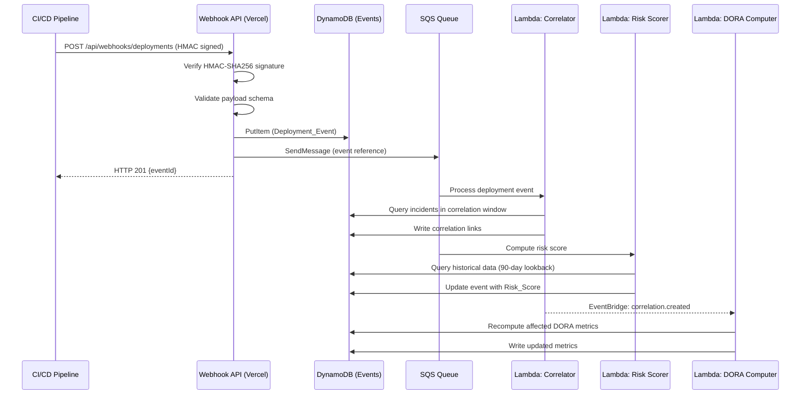
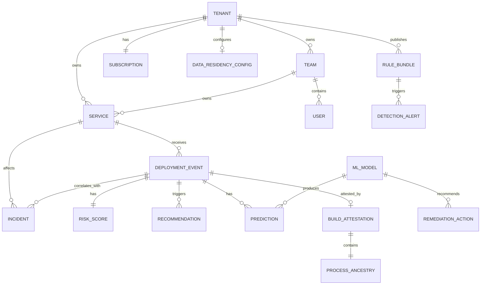

# Design Document — OllinAI B2B SaaS Platform

## Overview

OllinAI is a Change Intelligence and Deployment Risk platform that ingests deployment events and production incidents from CI/CD pipelines and alerting systems, computes DORA metrics and deployment risk scores, and provides actionable recommendations to reduce change failure rates. In Phase 2, the platform extends with an eBPF-based intelligence layer for deep runtime profiling and an AIOps ML engine for predictive intelligence and automated remediation.

### Technical Stack

| Layer | Technology | Rationale |
|-------|-----------|-----------|
| Frontend | Next.js on Vercel (scaffolded with v0) | SSR/ISR for fast dashboard loads, serverless edge functions for API routes |
| Database | DynamoDB (AWS) | Single-digit-ms latency, multi-tenant isolation via partition key design, on-demand scaling |
| Compute | Vercel Serverless Functions + AWS Lambda | Vercel for API routes/auth; Lambda for async processing (risk scoring, DORA computation, ML inference) |
| Messaging | Amazon SQS + EventBridge | Decoupled event-driven processing, at-least-once delivery for webhook ingestion |
| Caching | DynamoDB DAX / Vercel KV (Redis) | Dashboard query acceleration, rate limiting state |
| ML/AI | Amazon SageMaker (training) + Lambda (inference) | Managed training pipelines, model registry, low-latency inference endpoints |
| eBPF Agent | Rust binary + libbpf | Minimal overhead, cross-kernel compatibility, compiled to static binary and container image |
| Rule Distribution | Amazon ECR (OCI registry) | OCI-standard artifact distribution for Rule_Bundles, version retention, pull-based updates |
| Data Residency | Amazon S3 + STS + Cross-account IAM | Enterprise tenants keep raw telemetry in their own account; OllinAI reads via assumed roles |
| Auth | NextAuth.js + JWT | Standard OIDC/SSO support, 1-hour token validity |
| Real-time | Vercel Serverless + polling (30s interval) | Dashboard refresh without WebSocket infrastructure complexity |

### Key Design Decisions

1. **Multi-table DynamoDB design over single-table**: Given the diverse access patterns (time-series for events, graph-like for correlations, aggregation for metrics), we use multiple purpose-built tables with tenant-scoped partition keys rather than one overloaded table. This avoids hot partition issues at scale.

2. **Event-driven processing pipeline**: Webhook ingestion is synchronous (validate + persist + 201), but downstream processing (correlation, risk scoring, DORA recomputation, recommendations) is asynchronous via SQS queues. This keeps ingestion latency under 2 seconds.

3. **Compute split between Vercel and AWS Lambda**: Vercel handles user-facing API routes and SSR; AWS Lambda handles background processing triggered by SQS/EventBridge. This leverages Vercel's edge network for low-latency user interactions while using Lambda's integration with AWS services for backend work.

4. **eBPF Agent in Rust**: Rust provides the memory safety and performance required for kernel-adjacent tooling. The agent compiles to a static binary (no runtime dependencies) and a distroless container image.

5. **SageMaker for ML pipeline**: Managed training, automatic model versioning, built-in model registry, and endpoint deployment. Avoids building custom ML infrastructure.

6. **OCI-based Rule Distribution**: Detection rules are packaged as OCI artifacts in ECR, separate from the agent binary. This enables independent rule updates without agent redeployment, rollback to previous versions, and tenant-authored custom rules. The OCI standard ensures compatibility with existing container tooling.

7. **Cross-account IAM for Data Residency**: Enterprise tenants provide an IAM role ARN that OllinAI assumes via STS. Raw telemetry stays in the tenant's S3 bucket; OllinAI processing Lambdas run in the tenant's bucket region and only persist derived metrics. This satisfies data residency requirements without requiring separate infrastructure per tenant.

8. **Ed25519 Build Attestation Signing**: Each agent holds a unique Ed25519 private key for signing Build_Attestations. Ed25519 provides fast signing/verification, small signatures (64 bytes), and resistance to implementation errors compared to ECDSA.

---

## Architecture

### System Architecture Diagram

```mermaid
graph TB
    subgraph "External Systems"
        CICD[CI/CD Pipelines<br/>GitHub Actions, GitLab CI, Jenkins, CircleCI]
        INC[Incident Systems<br/>PagerDuty, OpsGenie]
        AGENT[OllinAI Agent<br/>eBPF Rust Binary]
    end

    subgraph "Tenant AWS Account (Data Residency)"
        TENANT_S3[Tenant S3 Bucket<br/>Telemetry + Attestations]
        TENANT_IAM[Cross-Account IAM Role<br/>STS AssumeRole]
    end

    subgraph "Vercel Edge"
        NEXTJS[Next.js App<br/>Dashboard + API Routes]
        AUTH[NextAuth.js<br/>JWT + SSO]
        WEBHOOK[Webhook API Routes<br/>HMAC Validation]
    end

    subgraph "AWS — Ingestion Layer"
        SQS_DEPLOY[SQS: deployment-events]
        SQS_INCIDENT[SQS: incidents]
        SQS_TELEMETRY[SQS: agent-telemetry]
        EB[EventBridge<br/>Event Router]
    end

    subgraph "AWS — Processing Layer"
        LAMBDA_CORRELATE[Lambda: Correlator]
        LAMBDA_RISK[Lambda: Risk Scorer]
        LAMBDA_DORA[Lambda: DORA Computer]
        LAMBDA_REC[Lambda: Recommendation Engine]
        LAMBDA_ML[Lambda: ML Inference]
        LAMBDA_RESIDENCY[Lambda: Data Residency Processor<br/>Runs in tenant bucket region]
    end

    subgraph "AWS — Rule Engine"
        ECR_RULES[ECR: OCI Rule Registry<br/>Rule_Bundle Artifacts]
        LAMBDA_RULES[Lambda: Rule Publisher]
    end

    subgraph "AWS — Data Layer"
        DDB_EVENTS[DynamoDB: Events]
        DDB_INCIDENTS[DynamoDB: Incidents]
        DDB_METRICS[DynamoDB: Metrics]
        DDB_CONFIG[DynamoDB: Config]
        DDB_AUDIT[DynamoDB: Audit Logs]
        DDB_ML[DynamoDB: ML Models & Predictions]
        DDB_RULES[DynamoDB: Rule Bundles]
        DDB_ATTEST[DynamoDB: Attestations]
        DDB_RESIDENCY[DynamoDB: Data Residency Config]
        DAX[DAX Cluster<br/>Read Cache]
    end

    subgraph "AWS — ML Layer"
        SM_TRAIN[SageMaker Training]
        SM_REGISTRY[Model Registry]
        SM_ENDPOINT[SageMaker Endpoint<br/>Real-time Inference]
    end

    CICD -->|Webhook + HMAC| WEBHOOK
    INC -->|Webhook + HMAC| WEBHOOK
    AGENT -->|Batch Telemetry| WEBHOOK
    AGENT -->|Data Residency Mode| TENANT_S3
    AGENT -->|Pull Rule_Bundles| ECR_RULES

    WEBHOOK -->|Persist + Enqueue| SQS_DEPLOY
    WEBHOOK -->|Persist + Enqueue| SQS_INCIDENT
    WEBHOOK -->|Persist + Enqueue| SQS_TELEMETRY

    SQS_DEPLOY --> LAMBDA_CORRELATE
    SQS_INCIDENT --> LAMBDA_CORRELATE
    SQS_DEPLOY --> LAMBDA_RISK
    SQS_TELEMETRY --> LAMBDA_RISK

    LAMBDA_CORRELATE -->|Write Correlations| DDB_EVENTS
    LAMBDA_CORRELATE --> EB
    EB --> LAMBDA_DORA
    EB --> LAMBDA_REC

    LAMBDA_RISK -->|Write Risk Score| DDB_EVENTS
    LAMBDA_DORA -->|Write Metrics| DDB_METRICS
    LAMBDA_REC -->|Write Recommendations| DDB_CONFIG

    LAMBDA_ML --> SM_ENDPOINT
    SM_TRAIN --> SM_REGISTRY

    LAMBDA_RESIDENCY -->|STS AssumeRole| TENANT_IAM
    TENANT_IAM -->|Read Telemetry| TENANT_S3
    LAMBDA_RESIDENCY -->|Write Derived Metrics Only| DDB_METRICS

    LAMBDA_RULES -->|Publish Bundle| ECR_RULES
    LAMBDA_RULES -->|Store Metadata| DDB_RULES

    NEXTJS -->|Read| DAX
    DAX -->|Cache Miss| DDB_EVENTS
    DAX -->|Cache Miss| DDB_METRICS

    AUTH --> NEXTJS
```



### Request Flow — Deployment Event Ingestion



---

## Components and Interfaces

### 1. Webhook Ingestion Service (Vercel API Routes)

**Responsibility**: Receive, validate, persist, and enqueue deployment events, incidents, and telemetry.

```typescript
// POST /api/webhooks/deployments
interface DeploymentEventPayload {
  commitShas: string[];        // 1-50 SHAs
  author: string;              // Author identifier
  services: string[];          // 1-20 affected service names
  deploymentTimestamp: string; // ISO 8601
  environment: string;         // e.g., "production", "staging"
  changeSize?: {
    linesAdded?: number;
    linesRemoved?: number;
    filesChanged?: number;
  };
}

interface WebhookResponse {
  eventId: string;
  status: "created" | "duplicate";
}

// POST /api/webhooks/incidents
interface IncidentPayload {
  externalId: string;
  severity: "low" | "medium" | "high" | "critical";
  affectedService: string;
  detectionTimestamp: string;  // ISO 8601
  resolutionTimestamp?: string;
}
```

**Validation**: JSON Schema validation with Zod. HMAC-SHA256 signature verification using per-integration 32+ byte secret keys.

### 2. Correlation Engine (AWS Lambda)

**Responsibility**: Link incidents to deployment events within the correlation window.

```typescript
interface CorrelationResult {
  incidentId: string;
  correlatedDeployments: {
    eventId: string;
    temporalProximityMs: number;
    rank: number;
  }[];
  status: "correlated" | "uncorrelated";
}
```

**Algorithm**: Query DynamoDB GSI on `(tenantId, serviceId, deploymentTimestamp)` for events within the correlation window. Rank by temporal proximity (most recent first).

### 3. Risk Scoring Engine (AWS Lambda)

**Responsibility**: Compute risk scores for deployment events using weighted risk factors.

```typescript
interface RiskFactors {
  changeFailureRate: number;   // 0-1, weight default 0.35
  changeSize: number;          // 0-1, weight default 0.25
  deploymentTiming: number;    // 0-1, weight default 0.20
  authorFailureRate: number;   // 0-1, weight default 0.20
  // Phase 2 additions (optional):
  supplyChainAnomaly?: number;
  resourceAnomaly?: number;
}

interface RiskScoreResult {
  score: "low" | "medium" | "high" | "critical";
  factors: RiskFactors;
  weights: Record<keyof RiskFactors, number>;
  source: "rule_engine" | "ml_model";
}
```

**Thresholds**: low (0–0.3), medium (0.3–0.55), high (0.55–0.8), critical (0.8–1.0).

### 4. DORA Metrics Computer (AWS Lambda)

**Responsibility**: Incrementally compute and cache DORA metrics per team/service.

```typescript
interface DORAMetrics {
  deploymentFrequency: number | "insufficient_data";
  leadTimeHours: number | "insufficient_data";
  changeFailureRate: number | "insufficient_data";
  mttrHours: number | "insufficient_data";
  unresolvedIncidentCount: number;
  period: { start: string; end: string };
  filters: { team?: string; service?: string; environment?: string };
}
```

**Computation triggers**: EventBridge events from ingestion (new deployment or incident). Incremental update within 60 seconds.

### 5. Recommendation Engine (AWS Lambda)

**Responsibility**: Generate actionable recommendations for high/critical risk deployments.

```typescript
interface Recommendation {
  id: string;
  category: "reduce_change_size" | "adjust_timing" | "increase_review" | "split_service" | "add_canary";
  targetService: string;
  targetTeam: string;
  triggeringMetrics: Record<string, number>;
  timeRangeEvaluated: { start: string; end: string };
  generatedAt: string;
  dismissedAt?: string;
  suppressedUntil?: string;
}
```

### 6. Dashboard (Next.js Pages)

**Responsibility**: Render DORA metrics, deployment timelines, risk histograms, and recommendations.

**Pages**:
- `/dashboard` — Summary view with DORA metrics, trend indicators, risk distribution
- `/dashboard/deployments` — Timeline view with color-coded risk scores
- `/dashboard/[teamId]` — Team-scoped view
- `/dashboard/[serviceId]` — Service-scoped view
- `/settings/teams` — Team/service management
- `/settings/integrations` — Webhook configuration
- `/settings/billing` — Subscription tier management

**Data fetching**: Server components with 30-second revalidation via ISR. Client-side polling for near-real-time updates.

### 7. eBPF Agent (Phase 2, Rust Binary)

**Responsibility**: Capture runtime telemetry during CI/CD execution and post-deploy observation. Track full process ancestry trees, detect supply chain threats via rule-based detection, and generate signed Build_Attestation documents per pipeline run.

```rust
// Core agent modules
pub struct OllinAgent {
    config: AgentConfig,
    collector: CollectorClient,
    buffer: TelemetryBuffer,         // Local ring buffer (5 min capacity)
    baseline: BaselineStore,          // Rolling averages for anomaly detection
    mode: AgentMode,                 // Profiling | CanaryObservation | BaselineBuilding
    rule_engine: RuleEngine,         // Loaded from OCI Rule_Bundle
    attestation_builder: AttestationBuilder, // Accumulates events for Build_Attestation
    signing_key: Ed25519PrivateKey,  // Per-agent signing key for attestations
}

pub enum AgentMode {
    Profiling,
    CanaryObservation,
    BaselineBuilding,
    MonitorOnly,   // Rule matches are logged, pipeline not terminated
    Enforcement,   // Critical rule matches terminate the job
}

pub enum TelemetryEvent {
    ProcessTree { pid: u32, ppid: u32, comm: String, argv: Vec<String>, cwd: PathBuf },
    NetworkConnect { pid: u32, dest_addr: IpAddr, dest_port: u16, domain: Option<String> },
    FileWrite { pid: u32, path: PathBuf, bytes_written: u64 },
    FileRead { pid: u32, path: PathBuf },  // Credential access tracking
    ResourceUsage { cpu_percent: f32, memory_bytes: u64, timestamp: u64 },
    SyscallProfile { syscall_id: u32, count: u64, latency_ns: u64 },
}

/// Process ancestry tracking — maintains full parent-child tree
pub struct ProcessAncestry {
    processes: HashMap<u32, ProcessNode>,
    root_pid: u32,
}

pub struct ProcessNode {
    pid: u32,
    ppid: u32,
    comm: String,
    argv: Vec<String>,
    cwd: PathBuf,
    children: Vec<u32>,
    start_time: u64,
}

/// Build attestation generated at pipeline completion
pub struct BuildAttestation {
    pipeline_id: String,
    tenant_id: String,
    process_ancestry: ProcessAncestry,
    network_connections: Vec<NetworkConnectionRecord>,
    sensitive_file_writes: Vec<FileWriteRecord>,
    telemetry_digest: [u8; 32],   // SHA-256 of complete telemetry stream
    signature: Ed25519Signature,   // Signed with per-agent key
    generated_at: u64,
}
```

**Process_Ancestry Tracking**: The agent attaches eBPF probes to `execve`, `fork`, and `clone` syscalls to construct a real-time process tree. Every observed process records its parent PID, command, arguments, and working directory. The tree is used for:
1. Supply chain detection (credential access from package installer descendants)
2. Build_Attestation generation (complete execution lineage)

**Build_Attestation Generation**: At pipeline completion, the agent serializes the complete process tree, network connections, and file writes into an in-toto-compatible attestation document. The attestation includes a SHA-256 digest of the raw telemetry stream for tamper detection. The document is signed with the agent's Ed25519 private key before transmission.

**Distribution**: Static binary (musl-linked) for VM runners; distroless container image for Kubernetes sidecars.

### 8. AIOps ML Engine (Phase 2, SageMaker + Lambda)

**Responsibility**: Train, serve, and manage ML models for prediction, anomaly detection, and remediation.

```typescript
interface FeatureVector {
  changeSizeFiles: number;
  changeSizeLines: number;
  deployHourOfDay: number;
  deployDayOfWeek: number;
  serviceFailureRate30d: number;
  authorFailureRate90d: number;
  timeSinceLastIncident: number;
  dependencyCount: number;
  ebpfAnomalyScore?: number;  // When available
}

interface PredictionResult {
  predictionScore: number;     // 0.0 to 1.0
  modelVersion: string;
  inferenceLatencyMs: number;
  source: "ml_model";
}

interface RemediationAction {
  type: "rollback" | "halt_canary" | "scale_up" | "notify_oncall";
  confidence: number;
  triggeringEvent: string;
  predictionScore: number;
  modelVersion: string;
  autoExecute: boolean;
}
```

### 9. API Gateway (Vercel API Routes)

**Responsibility**: RESTful API for data export (Enterprise tier).

```typescript
// GET /api/v1/deployments?service=X&team=Y&from=DATE&to=DATE&risk=high&page=1&pageSize=25
interface PaginatedResponse<T> {
  data: T[];
  pagination: {
    totalCount: number;
    currentPage: number;
    pageSize: number;
    hasMore: boolean;
  };
}
```

**Rate limiting**: 100 requests/min per tenant, enforced via Vercel KV (Redis) sliding window counter.

### 10. Externalized Rule Engine (Phase 2)

**Responsibility**: Manage, distribute, and evaluate detection rules independently of the agent binary. Rules are packaged as OCI artifacts and distributed to agents via a private OCI registry.

```typescript
// Rule_Bundle metadata stored in DynamoDB
interface RuleBundleMetadata {
  tenantId: string;
  bundleVersion: string;          // Semantic versioning (e.g., "1.2.0")
  ociDigest: string;              // OCI artifact digest (sha256)
  ruleCount: number;
  categories: string[];           // e.g., ["credential_access", "exfiltration", "crypto_miner"]
  publishedAt: string;            // ISO 8601
  publishedBy: string;            // Actor ID
  isBaseline: boolean;            // OllinAI-provided vs tenant-authored
}

// Declarative YAML rule language schema
interface DetectionRule {
  id: string;
  name: string;
  description: string;
  severity: "info" | "warning" | "critical";
  match: {
    processAncestry?: AncestryPattern;    // Match on process tree patterns
    fileAccess?: FileAccessPattern;        // Match on file path patterns
    networkDestination?: NetworkPattern;    // Match on domain/IP/port
    resourceThreshold?: ResourcePattern;   // Match on CPU/memory thresholds
  };
  conditions?: ConditionGroup;            // AND/OR combinators
}

interface AncestryPattern {
  ancestorCommand: string;    // Regex match on ancestor process command
  descendantCommand?: string; // Optional: specific descendant command
  maxDepth?: number;          // Max ancestry depth to search
}
```

```yaml
# Example: Custom detection rule in YAML
- id: "custom-cred-access-001"
  name: "Credential access from build tool"
  description: "Detects credential file reads by descendants of build tools"
  severity: critical
  match:
    processAncestry:
      ancestorCommand: "^(npm|pip|cargo|go)\\s+(install|build|get)"
    fileAccess:
      paths:
        - "~/.aws/credentials"
        - "~/.docker/config.json"
        - "**/*.pem"
      operation: read
```

**Architecture**:
- **OCI Registry**: Private ECR registry hosts Rule_Bundle OCI artifacts
- **Distribution**: Agents poll for updates at configurable interval (default 6h, range 1h–24h)
- **Hot-reload**: New rules applied without agent restart via in-memory rule set replacement
- **Versioning**: Semantic versioning; registry retains 3 most recent versions for rollback
- **Modes**: Monitor-only (log matches, no termination) and Enforcement (critical matches terminate pipeline)

### 11. Data Residency Service (Phase 2, AWS Lambda)

**Responsibility**: Enable Enterprise tenants to keep raw telemetry in their own AWS account. OllinAI reads data via cross-account IAM roles for processing, never persisting raw telemetry on OllinAI infrastructure.

```typescript
// Data Residency configuration
interface DataResidencyConfig {
  tenantId: string;
  enabled: boolean;
  s3BucketArn: string;           // arn:aws:s3:::tenant-ollinai-telemetry
  s3BucketRegion: string;        // e.g., "us-west-2", "eu-west-1"
  crossAccountRoleArn: string;   // IAM role in tenant's account
  externalId: string;            // For STS assume-role condition
  validatedAt: string;           // Last successful connectivity check
  status: "active" | "pending_validation" | "error";
}

// Telemetry routing decision
interface TelemetryDestination {
  type: "collector_api" | "s3_bucket";
  endpoint: string;              // Collector URL or S3 bucket path
  region?: string;               // AWS region for S3 destination
}

// Cross-account read flow
interface CrossAccountReadConfig {
  roleArn: string;
  externalId: string;
  sessionDuration: number;       // STS session duration (default 3600s)
  region: string;                // Must match bucket region
}
```

**Flow**:
1. **Agent → Tenant S3**: When Data_Residency_Mode is enabled, the agent writes telemetry batches and Build_Attestations directly to the tenant's S3 bucket (using credentials provided during agent configuration)
2. **OllinAI → Tenant S3 (read)**: Processing Lambdas assume the cross-account IAM role via STS to read telemetry from the tenant's bucket
3. **Processing**: Lambda functions run in the same AWS region as the tenant's bucket to minimize latency and cross-region data transfer
4. **Output**: Only derived metrics (Risk_Scores, Anomaly_Signals, Prediction_Scores) are stored in OllinAI DynamoDB tables — never raw telemetry

**Validation**: On configuration, OllinAI writes and reads a test object (`ollinai-connectivity-test/{timestamp}`) to verify IAM role permissions. Validation must complete within 30 seconds.

---

## Data Models

### DynamoDB Table Design

The platform uses a multi-table design with tenant-scoped partition keys for strict data isolation.

#### Table: `ollinai-events`

| Attribute | Type | Key | Description |
|-----------|------|-----|-------------|
| PK | String | Partition | `TENANT#{tenantId}#SVC#{serviceId}` |
| SK | String | Sort | `DEPLOY#{timestamp}#{eventId}` |
| eventId | String | — | UUID |
| commitShas | StringSet | — | 1-50 commit SHAs |
| author | String | — | Author identifier |
| services | StringSet | — | Affected service names |
| environment | String | — | Target environment |
| changeSize | Map | — | `{linesAdded, linesRemoved, filesChanged}` |
| teamId | String | — | Owning team (or "UNASSIGNED") |
| riskScore | String | — | low/medium/high/critical/indeterminate |
| riskFactors | Map | — | Factor breakdown |
| correlatedIncidents | List | — | Incident IDs |
| predictionScore | Number | — | ML prediction (0.0-1.0) |
| predictionSource | String | — | "rule_engine" or "ml_model" |
| createdAt | String | — | ISO 8601 |

**GSI-1** (Correlation lookup): PK=`TENANT#{tenantId}#SVC#{serviceId}`, SK=`TS#{deploymentTimestamp}`
**GSI-2** (Team view): PK=`TENANT#{tenantId}#TEAM#{teamId}`, SK=`DEPLOY#{timestamp}`
**GSI-3** (Deduplication): PK=`TENANT#{tenantId}#DEDUP`, SK=`{commitSha}#{service}#{env}`

#### Table: `ollinai-incidents`

| Attribute | Type | Key | Description |
|-----------|------|-----|-------------|
| PK | String | Partition | `TENANT#{tenantId}#SVC#{serviceId}` |
| SK | String | Sort | `INC#{detectionTimestamp}#{incidentId}` |
| incidentId | String | — | UUID |
| externalId | String | — | External system ID |
| severity | String | — | low/medium/high/critical |
| detectionTimestamp | String | — | ISO 8601 |
| resolutionTimestamp | String | — | ISO 8601 (nullable) |
| correlatedDeployments | List | — | Ranked deployment IDs |
| correlationStatus | String | — | correlated/uncorrelated |

**GSI-1** (Time range queries): PK=`TENANT#{tenantId}`, SK=`INC#{detectionTimestamp}`

#### Table: `ollinai-metrics`

| Attribute | Type | Key | Description |
|-----------|------|-----|-------------|
| PK | String | Partition | `TENANT#{tenantId}#SCOPE#{scopeType}#{scopeId}` |
| SK | String | Sort | `PERIOD#{periodStart}#{periodEnd}` |
| deploymentFrequency | Number | — | Count per period |
| leadTimeHours | Number | — | Average lead time |
| changeFailureRate | Number | — | Percentage (0-100) |
| mttrHours | Number | — | Average recovery time |
| unresolvedCount | Number | — | Unresolved incidents |
| dataPoints | Number | — | Count for "insufficient data" check |
| computedAt | String | — | Last computation timestamp |

#### Table: `ollinai-config`

| Attribute | Type | Key | Description |
|-----------|------|-----|-------------|
| PK | String | Partition | `TENANT#{tenantId}` |
| SK | String | Sort | Entity type prefix (TEAM#, SVC#, INTEGRATION#, SUBSCRIPTION#, USER#, etc.) |
| entityData | Map | — | Entity-specific fields |

Stores: Teams, Services, Integrations, Subscriptions, User roles, Risk factor weights, Correlation window config, Recommendations.

#### Table: `ollinai-audit`

| Attribute | Type | Key | Description |
|-----------|------|-----|-------------|
| PK | String | Partition | `TENANT#{tenantId}` |
| SK | String | Sort | `AUDIT#{timestamp}#{auditId}` |
| actor | String | — | User ID |
| action | String | — | Action performed |
| targetResource | String | — | Resource identifier |
| sourceIp | String | — | Request source IP |
| outcome | String | — | success/failure |
| timestamp | String | — | ISO 8601 (ms precision) |

**TTL**: Not applied (365-day minimum retention enforced at application level, no DynamoDB TTL).

#### Table: `ollinai-ml` (Phase 2)

| Attribute | Type | Key | Description |
|-----------|------|-----|-------------|
| PK | String | Partition | `TENANT#{tenantId}#MODEL` |
| SK | String | Sort | `VERSION#{modelVersion}` |
| modelVersion | String | — | Semver identifier |
| trainingTimestamp | String | — | ISO 8601 |
| datasetVersion | String | — | Training data snapshot ID |
| featureSet | List | — | Features used |
| metrics | Map | — | `{precision, recall, f1, aucRoc}` |
| status | String | — | staging/production/retired |
| driftScore | Number | — | Current drift measurement |

**GSI-1** (Active model lookup): PK=`TENANT#{tenantId}#ACTIVE_MODEL`, SK=`STATUS#production`

#### Table: `ollinai-rule-bundles` (Phase 2)

| Attribute | Type | Key | Description |
|-----------|------|-----|-------------|
| PK | String | Partition | `TENANT#{tenantId}#RULES` |
| SK | String | Sort | `BUNDLE#{bundleVersion}` |
| bundleVersion | String | — | Semantic version (e.g., "1.2.0") |
| ociDigest | String | — | OCI artifact SHA-256 digest |
| ociRegistryUri | String | — | Full ECR URI for the artifact |
| ruleCount | Number | — | Number of rules in bundle |
| categories | StringSet | — | Rule categories covered |
| isBaseline | Boolean | — | OllinAI-provided vs custom |
| publishedAt | String | — | ISO 8601 |
| publishedBy | String | — | Actor identity |
| status | String | — | active/rollback/deprecated |

**GSI-1** (Active bundle lookup): PK=`TENANT#{tenantId}#ACTIVE_BUNDLE`, SK=`STATUS#active`
**GSI-2** (Baseline bundles): PK=`BASELINE#RULES`, SK=`BUNDLE#{bundleVersion}`

**Retention**: Only the 3 most recent versions per tenant are retained in active state; older versions are marked deprecated.

#### Table: `ollinai-attestations` (Phase 2)

| Attribute | Type | Key | Description |
|-----------|------|-----|-------------|
| PK | String | Partition | `TENANT#{tenantId}#SVC#{serviceId}` |
| SK | String | Sort | `ATTEST#{timestamp}#{attestationId}` |
| attestationId | String | — | UUID |
| pipelineId | String | — | CI/CD pipeline identifier |
| eventId | String | — | Associated Deployment_Event ID |
| processCount | Number | — | Total processes in ancestry tree |
| networkConnectionCount | Number | — | Outbound connections recorded |
| sensitiveFileWriteCount | Number | — | Writes to sensitive paths |
| telemetryDigest | String | — | SHA-256 hex of telemetry stream |
| signaturePublicKey | String | — | Public key ID for verification |
| signature | String | — | Base64-encoded Ed25519 signature |
| generatedAt | String | — | ISO 8601 |
| agentVersion | String | — | Agent binary version |

**GSI-1** (By event): PK=`TENANT#{tenantId}#EVENT#{eventId}`, SK=`ATTEST#{timestamp}`

#### Table: `ollinai-data-residency` (Phase 2)

| Attribute | Type | Key | Description |
|-----------|------|-----|-------------|
| PK | String | Partition | `TENANT#{tenantId}#RESIDENCY` |
| SK | String | Sort | `CONFIG#current` |
| enabled | Boolean | — | Data_Residency_Mode active |
| s3BucketArn | String | — | Tenant's S3 bucket ARN |
| s3BucketRegion | String | — | AWS region of tenant bucket |
| crossAccountRoleArn | String | — | IAM role ARN for STS assume |
| externalId | String | — | STS external ID condition |
| validatedAt | String | — | Last successful validation |
| status | String | — | active/pending_validation/error |
| configuredBy | String | — | Actor who set up residency |
| configuredAt | String | — | ISO 8601 |

### Entity Relationships



---

## Correctness Properties

*A property is a characteristic or behavior that should hold true across all valid executions of a system — essentially, a formal statement about what the system should do. Properties serve as the bridge between human-readable specifications and machine-verifiable correctness guarantees.*

### Property 1: Deployment event round-trip persistence

*For any* valid `DeploymentEventPayload` with 1–50 commit SHAs, 1–20 service names, a non-empty author, a valid ISO 8601 timestamp, a non-empty environment, and optional change size metadata, submitting it to the ingestion endpoint SHALL result in an HTTP 201 response containing a UUID event identifier, and querying that identifier SHALL return a persisted event with all submitted fields intact.

**Validates: Requirements 1.1, 1.2**

### Property 2: Validation error specificity

*For any* webhook payload (deployment or incident) where one or more required fields are omitted or have an invalid type, the system SHALL return an HTTP 400 response whose error body references every invalid or missing field by name, and the set of named fields in the error SHALL exactly equal the set of fields that violate the schema.

**Validates: Requirements 1.3, 2.6, 11.6**

### Property 3: Deduplication idempotence

*For any* valid `DeploymentEventPayload`, submitting it once SHALL return HTTP 201 and submitting the same payload (matching commit SHA, service, and environment) a second time SHALL return HTTP 200, and the total count of persisted events for that combination SHALL remain exactly one.

**Validates: Requirements 1.5**

### Property 4: Team assignment correctness

*For any* `DeploymentEvent` referencing a set of services, and *for any* service-to-team ownership mapping, the persisted event SHALL be associated with the team that owns the referenced service at ingestion time; if no ownership exists, the event SHALL be associated with "UNASSIGNED".

**Validates: Requirements 1.6, 1.7**

### Property 5: Incident correlation correctness

*For any* incident with a detection timestamp T and *for any* set of deployment events for the same service, the correlation engine SHALL create correlation links to exactly those deployments whose timestamp falls within [T - CorrelationWindow, T], ranked in descending order of temporal proximity (most recent first). If no deployments fall within the window, the incident SHALL be marked "uncorrelated" with zero correlation links.

**Validates: Requirements 2.2, 2.5, 2.7**

### Property 6: Correlation window bounds validation

*For any* duration value D, configuring the correlation window SHALL succeed if and only if 5 minutes ≤ D ≤ 24 hours. Values outside this range SHALL be rejected with a validation error.

**Validates: Requirements 2.4**

### Property 7: DORA metrics computation correctness

*For any* set of deployment events and incidents within a time range [start, end] for a given scope (team, service, environment):
- Deployment Frequency SHALL equal the count of deployment events matching the scope and range
- Lead Time SHALL equal the average of (deployment timestamp - earliest commit timestamp) for each event
- Change Failure Rate SHALL equal (events with correlated incidents / total events) × 100
- MTTR SHALL equal the average of (resolution timestamp - detection timestamp) for resolved incidents only

When fewer than 3 data points exist for any metric, that metric SHALL return "insufficient_data" rather than a numeric value.

**Validates: Requirements 3.1, 3.2, 3.3, 3.4, 3.5, 3.7, 3.8**

### Property 8: Risk score weighted computation

*For any* deployment event with computable risk factors (change failure rate, change size, deployment timing, author failure rate), and *for any* valid weight configuration W where all weights ∈ [0,1] and sum to 1.0, the computed risk score SHALL equal the sum of (factor_value × factor_weight) for each factor, and the categorical classification SHALL be: low for [0, 0.3), medium for [0.3, 0.55), high for [0.55, 0.8), critical for [0.8, 1.0].

**Validates: Requirements 4.1, 4.2, 4.3**

### Property 9: Risk weight validation

*For any* set of risk factor weights, the system SHALL accept the configuration if and only if every weight is in [0, 1] and the weights sum to exactly 1.0. All other weight configurations SHALL be rejected with a descriptive error.

**Validates: Requirements 4.4, 4.8**

### Property 10: Pre-deployment assessment is side-effect-free

*For any* proposed change metadata (service, author, change size, planned timestamp), calling the pre-deployment risk assessment API SHALL return a valid Risk_Score, and the total count of persisted deployment events SHALL be unchanged after the call.

**Validates: Requirements 4.6**

### Property 11: Recommendation category mapping

*For any* deployment event with a risk score of high or critical, the system SHALL generate at least one recommendation whose category corresponds to the risk factor with the highest weighted contribution: "reduce_change_size" when change size is dominant, "adjust_timing" when timing is dominant, "increase_review" when author failure rate is dominant.

**Validates: Requirements 5.1, 5.2**

### Property 12: Trend-based recommendation trigger

*For any* team with at least 5 deployment events in a 7-day window, if the change failure rate increases by more than 20 percentage points compared to the preceding 7-day window, the system SHALL generate a trend-based recommendation. If the increase is 20 percentage points or less, or fewer than 5 events exist, no trend recommendation SHALL be generated.

**Validates: Requirements 5.3**

### Property 13: Recommendation suppression after dismissal

*For any* dismissed recommendation with category C for team T and service S, the system SHALL not generate a new recommendation with the same category C for the same (T, S) pair within 14 days of the dismissal timestamp. After 14 days, the recommendation may be regenerated.

**Validates: Requirements 5.5**

### Property 14: Entity uniqueness and archive constraints

*For any* tenant, team names SHALL be unique (case-insensitive), service names SHALL be unique (case-insensitive), and archiving a team SHALL succeed if and only if that team owns zero services. Teams with assigned services SHALL be rejected from archival.

**Validates: Requirements 6.1, 6.2, 6.6**

### Property 15: Service ownership temporal attribution

*For any* service ownership change at time T, deployment events ingested before T SHALL retain association with the previous owning team, and deployment events ingested at or after T SHALL be associated with the new owning team. Services referenced but not registered SHALL be auto-created as "UNASSIGNED".

**Validates: Requirements 6.3, 6.5**

### Property 16: Tenant data isolation

*For any* two distinct tenants A and B, and *for any* API query executed in the context of tenant A, the response SHALL contain zero records belonging to tenant B. This holds regardless of query parameters, filters, or access patterns.

**Validates: Requirements 7.1**

### Property 17: RBAC enforcement

*For any* user with role R and *for any* operation O on resource X:
- Viewer role: only read operations succeed; all create/update/delete operations return HTTP 403
- Team Lead role: read/write operations on resources belonging to their assigned teams succeed; operations on other teams' resources return HTTP 403
- Tenant Admin role: all operations succeed

**Validates: Requirements 7.2, 7.3, 7.7**

### Property 18: JWT authentication validation

*For any* JWT token, the system SHALL accept the request if the token is well-formed, has a valid signature, and has not expired (within 1-hour validity). The system SHALL return HTTP 401 if the token is missing, malformed, has an invalid signature, or is expired.

**Validates: Requirements 7.4, 7.5**

### Property 19: Subscription tier enforcement

*For any* tenant with subscription tier T and *for any* operation O:
- Starter tier: operations creating a 6th+ service SHALL be rejected; requests for Risk_Score, Recommendations, or incident correlation SHALL be rejected with an upgrade message
- Pro tier: no service limit; Risk_Score, Recommendations, and incident correlation available; AIOps predictions available
- Enterprise tier: all features available including audit logs, SSO, custom integrations, and API access

**Validates: Requirements 8.1, 8.2, 8.3, 8.4, 8.5**

### Property 20: HMAC webhook authentication

*For any* webhook payload P and integration secret key K (≥32 bytes), computing HMAC-SHA256(K, P) SHALL produce a signature that the system accepts. Any payload where the provided signature does not match HMAC-SHA256(K, P) SHALL be rejected with HTTP 401.

**Validates: Requirements 10.5, 10.6**

### Property 21: Pagination consistency

*For any* dataset of N records and page parameters (pageSize in [1, 100], page ≥ 1), the response SHALL contain at most pageSize records, totalCount SHALL equal N, currentPage SHALL equal the requested page, and hasMore SHALL be true if and only if (page × pageSize) < N. The default pageSize SHALL be 25.

**Validates: Requirements 11.2**

### Property 22: API filter correctness

*For any* dataset and *for any* combination of valid filter parameters (service, team, time range, risk score severity), the returned records SHALL include only those that match ALL specified filters. Unspecified filters SHALL not constrain results. Empty result sets SHALL return HTTP 200 with an empty array and totalCount of zero.

**Validates: Requirements 11.5, 11.7**

### Property 23: Audit log completeness and immutability

*For any* auditable action (configuration change, data access, API export) performed by actor A on resource R, an audit log entry SHALL exist with: actor identity, action name, target resource, UTC timestamp with millisecond precision, source IP, and outcome (success/failure). No audit log entry SHALL be modifiable or deletable by any user.

**Validates: Requirements 12.1, 12.2, 12.5**

### Property 24: eBPF anomaly detection against baseline

*For any* pipeline execution with an established baseline (≥5 prior executions), if the current execution's CPU or memory consumption exceeds 2× the rolling average of the previous 10 executions, a resource anomaly flag SHALL be raised. If an outbound network connection targets a domain not in the baseline, a supply chain anomaly flag SHALL be raised. During baseline-building mode (<5 executions), no anomaly flags SHALL be generated.

**Validates: Requirements 13.3, 13.4, 13.9**

### Property 25: Telemetry batching invariant

*For any* sequence of telemetry events captured by the eBPF agent, events SHALL be transmitted to the Collector API in batches of no more than 500 events each. No batch SHALL exceed 500 events regardless of event generation rate.

**Validates: Requirements 13.5**

### Property 26: Syscall profile deviation detection

*For any* post-deployment syscall profile and *for any* rolling baseline (computed from previous 10 successful deployments), the agent SHALL flag a deviation if and only if the divergence between the current profile and baseline exceeds the configured threshold (default 30%, configurable 5–95%). Divergence below threshold SHALL result in a healthy canary report.

**Validates: Requirements 14.2, 14.5**

### Property 27: Deployment gate decision

*For any* proposed deployment with a combined score (ML Prediction_Score + rule-based Risk_Score), the gate API SHALL return:
- "proceed" when the score is below the lower threshold (default 0.5)
- "warn" when the score is between the lower and upper thresholds (default 0.5–0.8)
- "block" when the score exceeds the upper threshold (default 0.8)

Thresholds are configurable per service. "block" responses SHALL include contributing risk factors and suggested mitigations.

**Validates: Requirements 17.6, 17.7**

### Property 28: Model drift detection and retraining trigger

*For any* computed Drift_Score comparing current Feature_Vector distributions against the training dataset distribution, when the Drift_Score exceeds 0.7, an immediate retraining cycle SHALL be triggered. When the Drift_Score is ≤ 0.7, no out-of-schedule retraining SHALL occur.

**Validates: Requirements 15.5, 15.6**

### Property 29: Process ancestry tree well-formedness

*For any* sequence of process spawn events (fork/exec) observed during a pipeline execution, the resulting Process_Ancestry tree SHALL be well-formed: every child process has exactly one valid parent, no cycles exist in the tree, the root process is the pipeline entrypoint, and all recorded parent-child relationships are consistent with the observed spawn events.

**Validates: Requirements 13.4**

### Property 30: Supply chain credential exfiltration detection

*For any* process that accesses a credential file (matching patterns: `~/.aws/credentials`, `~/.docker/config.json`, SSH private keys, or `GITHUB_TOKEN` environment reads), the agent SHALL flag it as a high-confidence supply chain credential exfiltration attempt if and only if the process's Process_Ancestry chain includes a package installation command (`npm install`, `pip install`, `go get`, `cargo build`, or equivalent). If no package installation ancestor exists, no exfiltration flag SHALL be raised.

**Validates: Requirements 13.5**

### Property 31: Build attestation completeness and digest integrity

*For any* completed pipeline execution with N telemetry events, the generated Build_Attestation SHALL contain: all processes from the Process_Ancestry tree, all outbound network connections with destination and initiating process, all file writes to sensitive paths, and a SHA-256 digest that, when recomputed over the same telemetry stream, produces an identical value.

**Validates: Requirements 13.6**

### Property 32: Build attestation signature verification

*For any* Build_Attestation document signed with an agent's Ed25519 private key, verifying the signature using the corresponding public key SHALL succeed. For any Build_Attestation where the content has been modified after signing (any byte changed), signature verification SHALL fail. For any Build_Attestation verified against a different agent's public key, verification SHALL fail.

**Validates: Requirements 13.7**

### Property 33: Rule_Bundle update interval validation

*For any* duration value D configured as the Rule_Bundle check interval, the system SHALL accept the configuration if and only if 1 hour ≤ D ≤ 24 hours. Values outside this range SHALL be rejected with a validation error.

**Validates: Requirements 18.2**

### Property 34: Detection rule YAML round-trip

*For any* valid detection rule expressed as a structured object (with id, name, severity, and match criteria on process ancestry, file access, network destinations, or resource thresholds), serializing it to YAML and parsing it back SHALL produce an equivalent rule object with all fields preserved.

**Validates: Requirements 18.4**

### Property 35: Detection alert event completeness

*For any* detection rule match during a pipeline execution, the emitted alert event SHALL contain: the rule identifier, matched process details (PID, command, arguments), the full Process_Ancestry chain from root to matched process, and the rule's severity level (info, warning, or critical). No field SHALL be null or omitted.

**Validates: Requirements 18.5**

### Property 36: Monitor vs enforcement mode behavior

*For any* detection rule match with severity S in agent mode M: when M is monitor-only, the pipeline SHALL continue execution regardless of S (match is logged but not acted upon). When M is enforcement and S is critical, the pipeline SHALL be terminated immediately. When M is enforcement and S is not critical (info or warning), the pipeline SHALL continue execution.

**Validates: Requirements 18.6**

### Property 37: Rule_Bundle version retention

*For any* sequence of Rule_Bundle publications for a tenant, the registry SHALL retain exactly the 3 most recent versions in active state. When a 4th version is published, the oldest of the 3 SHALL be marked deprecated. At no point SHALL more than 3 versions be in active state simultaneously.

**Validates: Requirements 18.8**

### Property 38: Telemetry routing by Data Residency mode

*For any* agent with Data_Residency_Mode configuration, when the mode is enabled, telemetry batches and Build_Attestations SHALL be routed to the tenant's designated S3 bucket. When the mode is disabled, telemetry SHALL be routed to the OllinAI Collector_API. No telemetry SHALL be sent to both destinations simultaneously.

**Validates: Requirements 19.1**

### Property 39: Data residency — no raw telemetry persistence on OllinAI infrastructure

*For any* telemetry processing operation performed in Data_Residency_Mode, the OllinAI-managed data stores SHALL contain only derived metrics (Risk_Scores, Anomaly_Signals, Prediction_Scores) and zero raw telemetry records (process events, network connections, file writes, resource usage samples) for that tenant.

**Validates: Requirements 19.3**

### Property 40: Data residency — region-matched processing

*For any* tenant with Data_Residency_Mode enabled and an S3 bucket in AWS region R, the processing Lambda functions invoked to read and process telemetry from that bucket SHALL execute in region R. No cross-region data transfer SHALL occur for telemetry reading.

**Validates: Requirements 19.6**

---

## Error Handling

### Error Categories and Responses

| Category | HTTP Status | Behavior |
|----------|-------------|----------|
| Schema validation failure | 400 | Return field-level error details |
| Authentication failure | 401 | Reject; log for audit |
| Authorization failure | 403 | Reject; log for audit |
| Duplicate event | 200 | Return existing event ID |
| Rate limit exceeded | 429 | Return Retry-After header |
| Processing failure (post-auth) | 422 | Return reason; do not acknowledge |
| Tier limit exceeded | 403 | Return upgrade suggestion |
| Risk computation failure | 200* | Persist event with "indeterminate" score; notify admin |
| ML model unavailable | 200* | Fall back to rule-based scoring |
| Agent connectivity loss | N/A (agent) | Buffer locally 5 min, retry 30s intervals |
| Agent buffer overflow | N/A (agent) | Drop oldest events, record drop count |
| Agent S3 write failure (residency) | N/A (agent) | Buffer locally 5 min, retry per standard buffer policy |
| Rule_Bundle fetch failure | N/A (agent) | Continue with last loaded bundle, log failure |
| Rule_Bundle parse failure | N/A (agent) | Reject bundle, retain previous, alert admin |
| Cross-account role assume failure | 500 (internal) | Retry with backoff; mark residency config as "error" |
| Training pipeline failure | N/A (async) | Alert after 3 consecutive failures; continue serving current model |

### Retry and Resilience Patterns

1. **Webhook ingestion**: Synchronous. No retries on the server side — the CI/CD system is responsible for retrying on non-2xx responses.
2. **SQS processing**: Lambda consumers use SQS visibility timeout (60s) and dead-letter queue (DLQ) after 3 failed attempts. DLQ messages trigger Tenant admin notifications.
3. **Agent telemetry**: Ring buffer with 5-minute capacity. Retry every 30 seconds. On buffer overflow, drop oldest events first.
4. **ML inference**: If SageMaker endpoint is unavailable, fall back to rule-based Risk_Score. Log degraded mode.
5. **Cross-service communication**: Circuit breaker pattern with exponential backoff (initial 1s, max 30s, 5 failures to open).

### Graceful Degradation

- If the correlation engine is delayed, deployment events are still persisted (eventually consistent correlation).
- If DORA metric recomputation is slow, dashboard shows last-computed values with a "computing" indicator.
- If the ML engine has insufficient data (<100 events, <10 incidents), the system transparently uses rule-based scoring.
- If eBPF probes cannot attach, the agent falls back to userspace collection and reports degraded status.
- If the OCI registry is unreachable for Rule_Bundle updates, the agent continues with its last successfully loaded bundle.
- If Data_Residency_Mode S3 writes fail, the agent buffers locally (same 5-minute buffer policy) and retries.
- If cross-account IAM role assumption fails for Data Residency reads, processing is paused for that tenant and the admin is notified.

---

## Testing Strategy

### Testing Pyramid

```
         ╭───────────╮
         │   E2E     │  ← Playwright: critical user flows (dashboard, webhook config)
         ├───────────┤
         │Integration│  ← DynamoDB Local, SQS mocks: ingestion → processing → query
         ├───────────┤
         │  Property │  ← fast-check: correctness properties (40 properties, 100+ iterations each)
         ├───────────┤
         │   Unit    │  ← Vitest: individual functions, validation, computation logic
         ╰───────────╯
```

### Property-Based Testing Configuration

- **Library**: [fast-check](https://github.com/dubzzz/fast-check) (TypeScript)
- **Framework**: Vitest
- **Minimum iterations**: 100 per property
- **Tag format**: `// Feature: b2b-saas-platform, Property {N}: {title}`

Each correctness property from the design document maps to exactly one property-based test:

| Property | Test File | Key Generators |
|----------|-----------|----------------|
| 1: Round-trip persistence | `tests/properties/ingestion.prop.test.ts` | `arbDeploymentEvent()` |
| 2: Validation error specificity | `tests/properties/validation.prop.test.ts` | `arbInvalidPayload()` |
| 3: Deduplication | `tests/properties/ingestion.prop.test.ts` | `arbDeploymentEvent()` |
| 4: Team assignment | `tests/properties/assignment.prop.test.ts` | `arbServiceTeamMapping()` |
| 5: Correlation correctness | `tests/properties/correlation.prop.test.ts` | `arbIncidentWithDeployments()` |
| 6: Correlation window bounds | `tests/properties/correlation.prop.test.ts` | `arbDuration()` |
| 7: DORA metrics | `tests/properties/dora.prop.test.ts` | `arbDeploymentSet(), arbIncidentSet()` |
| 8: Risk score computation | `tests/properties/risk.prop.test.ts` | `arbRiskFactors(), arbWeights()` |
| 9: Risk weight validation | `tests/properties/risk.prop.test.ts` | `arbWeightSet()` |
| 10: Side-effect-free assessment | `tests/properties/risk.prop.test.ts` | `arbProposedChange()` |
| 11: Recommendation mapping | `tests/properties/recommendations.prop.test.ts` | `arbHighRiskEvent()` |
| 12: Trend trigger | `tests/properties/recommendations.prop.test.ts` | `arbTeamHistory()` |
| 13: Suppression | `tests/properties/recommendations.prop.test.ts` | `arbDismissal()` |
| 14: Entity constraints | `tests/properties/entities.prop.test.ts` | `arbTeamName(), arbServiceName()` |
| 15: Ownership attribution | `tests/properties/entities.prop.test.ts` | `arbOwnershipChange()` |
| 16: Tenant isolation | `tests/properties/security.prop.test.ts` | `arbMultiTenantData()` |
| 17: RBAC enforcement | `tests/properties/security.prop.test.ts` | `arbRoleOperation()` |
| 18: JWT validation | `tests/properties/security.prop.test.ts` | `arbJwtToken()` |
| 19: Tier enforcement | `tests/properties/tiers.prop.test.ts` | `arbTierOperation()` |
| 20: HMAC authentication | `tests/properties/security.prop.test.ts` | `arbWebhookPayload()` |
| 21: Pagination | `tests/properties/api.prop.test.ts` | `arbDataset(), arbPageParams()` |
| 22: Filter correctness | `tests/properties/api.prop.test.ts` | `arbFilterParams()` |
| 23: Audit completeness | `tests/properties/audit.prop.test.ts` | `arbAuditableAction()` |
| 24: Anomaly detection | `tests/properties/ebpf.prop.test.ts` | `arbPipelineExecution()` |
| 25: Batching invariant | `tests/properties/ebpf.prop.test.ts` | `arbTelemetryStream()` |
| 26: Syscall deviation | `tests/properties/ebpf.prop.test.ts` | `arbSyscallProfile()` |
| 27: Gate decision | `tests/properties/ml.prop.test.ts` | `arbDeploymentScore()` |
| 28: Drift detection | `tests/properties/ml.prop.test.ts` | `arbFeatureDistribution()` |
| 29: Process ancestry tree | `tests/properties/ebpf.prop.test.ts` | `arbProcessSpawnSequence()` |
| 30: Credential exfiltration detection | `tests/properties/ebpf.prop.test.ts` | `arbProcessTreeWithCredAccess()` |
| 31: Attestation completeness | `tests/properties/attestation.prop.test.ts` | `arbTelemetryStream(), arbPipelineRun()` |
| 32: Attestation signature | `tests/properties/attestation.prop.test.ts` | `arbAttestationDoc(), arbKeyPair()` |
| 33: Rule interval validation | `tests/properties/rules.prop.test.ts` | `arbDuration()` |
| 34: Rule YAML round-trip | `tests/properties/rules.prop.test.ts` | `arbDetectionRule()` |
| 35: Alert completeness | `tests/properties/rules.prop.test.ts` | `arbRuleMatch()` |
| 36: Monitor vs enforcement | `tests/properties/rules.prop.test.ts` | `arbRuleMatchWithMode()` |
| 37: Bundle version retention | `tests/properties/rules.prop.test.ts` | `arbVersionSequence()` |
| 38: Telemetry routing | `tests/properties/residency.prop.test.ts` | `arbResidencyConfig()` |
| 39: No raw telemetry persistence | `tests/properties/residency.prop.test.ts` | `arbTelemetryProcessingOp()` |
| 40: Region-matched processing | `tests/properties/residency.prop.test.ts` | `arbRegionConfig()` |

### Unit Tests (Vitest)

Focus areas:
- Individual validation functions (Zod schemas)
- HMAC signature computation
- Risk score threshold classification
- DORA metric formulas with known inputs
- Recommendation category selection logic
- Pagination math
- Timestamp/duration parsing

### Integration Tests

- **DynamoDB Local**: Full ingestion → correlation → risk scoring flow
- **SQS mock**: Event routing and dead-letter queue behavior
- **Multi-tenant queries**: Verify partition-key isolation
- **Tier upgrade/downgrade**: Feature access transitions
- **Rate limiting**: Sliding window enforcement

### End-to-End Tests (Playwright)

- Dashboard loads with DORA metrics for seeded data
- Webhook integration configuration and test event flow
- Team/service management CRUD
- Subscription tier upgrade flow
- API export with pagination and filters (Enterprise tier)

### eBPF Agent Tests (Rust)

- **Unit tests**: Anomaly detection logic, buffer management, batch splitting, process ancestry tree construction, credential access pattern matching, Build_Attestation generation, SHA-256 digest computation
- **Integration tests**: eBPF probe attachment on supported kernels (CI uses kernel-capable VMs), attestation signing and verification, OCI bundle fetch
- **Property tests (proptest crate)**: Syscall profile deviation calculation, telemetry batching invariants, process ancestry tree well-formedness, credential exfiltration detection logic, attestation digest integrity

### Rule Engine Tests

- **Unit tests**: YAML rule parsing, rule matching logic per match type (ancestry, file, network, resource), severity classification, monitor vs enforcement mode decisions
- **Integration tests**: OCI artifact pull from ECR, hot-reload rule replacement, version retention enforcement
- **Property tests (fast-check)**: YAML rule round-trip, alert event completeness, mode behavior correctness, interval validation, version retention invariant

### Data Residency Tests

- **Unit tests**: Telemetry routing decision logic, region extraction from S3 ARN, cross-account config validation
- **Integration tests**: STS assume-role (mocked), S3 read/write (mocked or LocalStack), connectivity validation flow
- **Property tests (fast-check)**: Routing correctness, no-raw-telemetry invariant, region-matching logic

### ML Engine Tests

- **Unit tests**: Feature vector construction, drift score calculation, gate decision logic
- **Integration tests**: SageMaker training pipeline execution, model promotion flow
- **Property tests**: Prediction score bounds [0.0, 1.0], gate threshold consistency
