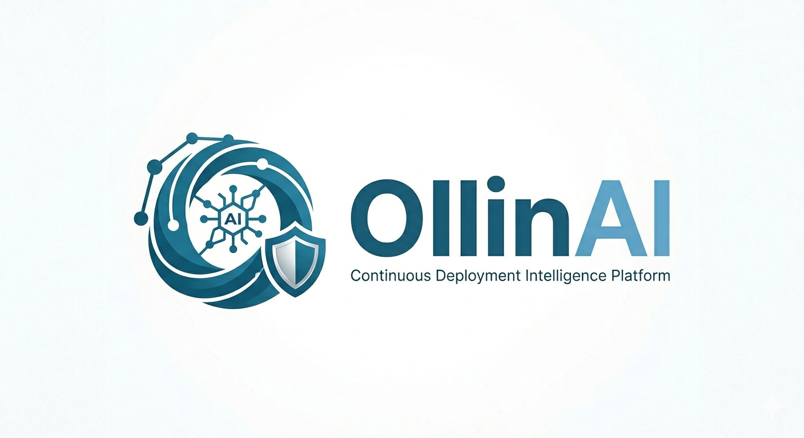
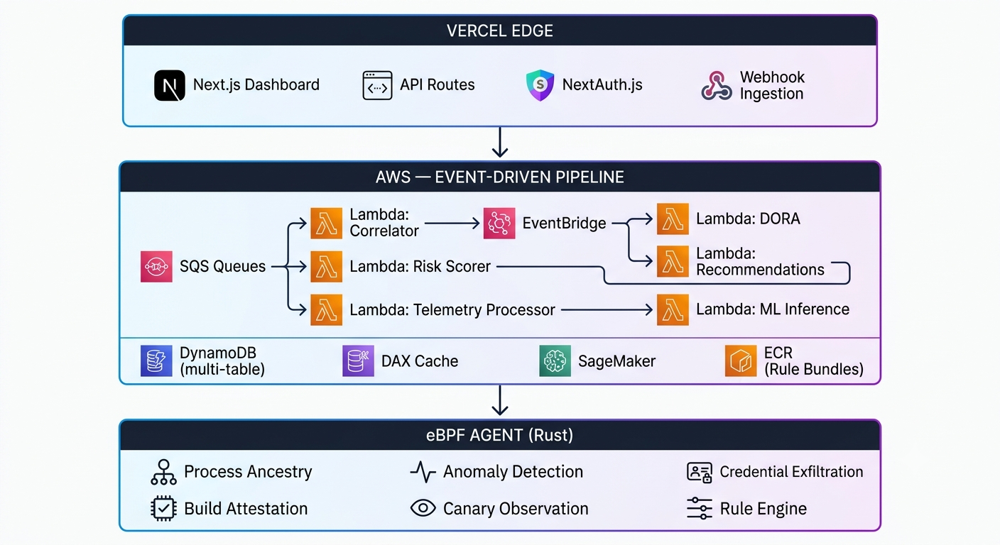

# OllinAI

**Change Intelligence & Deployment Risk Platform**

> From Nahuatl "Ollin" (movement/change) + AI — understanding the risk profile of every deployment.

OllinAI is a B2B SaaS platform that helps engineering teams reduce change failure rates, track DORA metrics, and understand the risk profile of every deployment. It ingests deployment events from CI/CD pipelines, correlates them with production incidents, computes risk scores, and provides actionable recommendations powered by machine learning.



---

## The Problem

Engineering teams at mid-market companies (50–500 engineers) deploy frequently but lack visibility into:
- **Which deployments cause incidents** — correlation happens manually, hours after the fact
- **What makes a deployment risky** — decisions are gut-feel, not data-driven
- **How to improve delivery performance** — DORA metrics are computed quarterly in spreadsheets
- **Supply chain threats** — malicious packages steal credentials during CI/CD with zero evidence left behind

## The Solution

OllinAI provides:

1. **Real-time DORA Metrics** — Deployment Frequency, Lead Time, Change Failure Rate, MTTR — computed incrementally as events flow in
2. **Deployment Risk Scoring** — Every deployment scored (low/medium/high/critical) using weighted factors: historical failure rate, change size, deployment timing, and author patterns
3. **Incident Correlation** — Automatically links production incidents to the deployments that caused them within a configurable time window
4. **Actionable Recommendations** — Specific, data-backed suggestions to reduce risk (split changes, adjust timing, add canary, increase review)
5. **AIOps ML Engine** — Continuously trained models that predict incidents before they happen, detect anomalies, and recommend automated remediation
6. **eBPF Runtime Security** — Deep kernel-level visibility into CI/CD pipeline execution, detecting supply chain attacks via process ancestry analysis
7. **Build Attestation** — Cryptographically signed evidence of what ran in every pipeline, conforming to the in-toto attestation framework

---

## Why DynamoDB

OllinAI's architecture leverages DynamoDB not just as a database, but as a **security enforcement layer**. The partition key model (`TENANT#{id}`) makes cross-tenant data access physically impossible at the storage layer — no SQL injection, no forgotten WHERE clause, no accidental data leak can cross partition boundaries.

Key architectural decisions:
- **Single-table design** for config entities — 10+ entity types in one table, zero schema migrations
- **GSI-driven access patterns** — 3 GSIs on the events table each serve a specific query (correlation, team view, deduplication)
- **ACID transactions** — Integration creation atomically writes records + audit logs
- **Conditional writes** — Optimistic locking for concurrent onboarding without distributed locks
- **DynamoDB Streams** — Table mutations trigger downstream processing (risk scoring, DORA computation)
- **Global Tables** — Active-active replication for enterprise data residency
- **TTL** — Automatic token cleanup without cron jobs

See [docs/dynamodb-strategic-usage.md](docs/dynamodb-strategic-usage.md) for the full data model and architectural reasoning.

---

## Architecture




## Tech Stack

| Layer | Technology |
|-------|-----------|
| Frontend | Next.js on Vercel (v0 scaffolded) |
| Database | DynamoDB (multi-table, DAX cached) |
| Compute | Vercel Serverless + AWS Lambda |
| Messaging | Amazon SQS + EventBridge |
| ML/AI | Amazon SageMaker (training + inference) |
| eBPF Agent | Rust + libbpf (static musl binary) |
| Rule Distribution | Amazon ECR (OCI artifacts) |
| Data Residency | S3 + STS cross-account IAM |
| Auth | NextAuth.js + JWT (1-hour validity) |
| Testing | Vitest + fast-check + Playwright + proptest |

---

## Monetization

Three-tier subscription model (Starter / Pro / Enterprise) targeting mid-market engineering organizations (50–500 engineers). See [pricing_strategy.md](./pricing_strategy.md) for details.

---

## CI/CD Security Posture (OWASP Top 10 CI/CD)

OllinAI maps detections to the [OWASP Top 10 CI/CD Security Risks](https://owasp.org/www-project-top-10-ci-cd-security-risks/):

| Risk | Coverage |
|------|----------|
| CICD-SEC-3: Dependency Chain Abuse | ✅ Monitored — supply chain credential exfiltration + unknown network flags |
| CICD-SEC-6: Insufficient Credential Hygiene | ✅ Monitored — credential file access from eBPF agent |
| CICD-SEC-9: Improper Artifact Integrity Validation | ✅ Monitored — Build Attestation generation status |
| CICD-SEC-10: Insufficient Logging and Visibility | ✅ Monitored — agent deployment coverage |
| CICD-SEC-1, 2, 4, 5, 7, 8 | 📋 Planned — guidance provided |

---

## Key Differentiators

1. **EDR for CI/CD** — eBPF-based runtime security sensor that captures full execution lineage before ephemeral runners are destroyed
2. **Process Ancestry Detection** — Doesn't just flag network connections; correlates credential access with package installer ancestry to distinguish legitimate use from supply chain attacks
3. **Continuously Trained ML** — Models improve automatically as deployment data accumulates, with drift detection and self-monitoring
4. **Deployment Gate API** — Integrates directly into CI/CD pipelines to proceed/warn/block based on combined ML prediction + rule-based risk
5. **Data Never Leaves Your Cloud** — Enterprise Data Residency mode routes all telemetry to the customer's own S3 bucket via cross-account IAM roles

---

## Getting Started

```bash
# Install dependencies
npm install

# Set up DynamoDB Local for development
docker run -p 8000:8000 amazon/dynamodb-local
npm run db:local:create

# Run development server
npm run dev

# Run tests
npm run test

# Run property-based tests
npm run test:properties

# Build for production
npm run build
```

### eBPF Agent (Rust)

```bash
cd agent

# Build (requires Linux or Docker)
cargo build --release --target x86_64-unknown-linux-musl

# Build container image
docker build -f Dockerfile.agent -t ollinai-agent .

# Run with config
./target/release/ollinai-agent --config agent.yaml --mode profiling
```

---

## Integrations

### GitHub Actions
```yaml
steps:
  - uses: ollinai/ollinai-deploy-event@v1
    with:
      api-url: https://app.ollinai.com
      secret-key: ${{ secrets.OLLINAI_SECRET_KEY }}
      services: api-service,auth-service
      environment: production
```

### GitLab CI
```yaml
include:
  - local: '.ollinai-deploy.yml'
```

### Generic Webhook
```bash
curl -X POST https://app.ollinai.com/api/webhooks/deployments \
  -H "X-OllinAI-Signature: sha256=$(echo -n $PAYLOAD | openssl dgst -sha256 -hmac $SECRET)" \
  -H "X-OllinAI-Integration: $TENANT_ID:$INTEGRATION_ID" \
  -d "$PAYLOAD"
```

---

## Project Structure

```
├── src/
│   ├── app/                    # Next.js App Router
│   │   ├── api/                # API routes (webhooks, settings, v1 export)
│   │   ├── dashboard/          # Dashboard pages and components
│   │   └── settings/           # Settings UI pages
│   ├── lambdas/                # AWS Lambda handlers
│   │   ├── correlator/         # Incident-deployment correlation
│   │   ├── risk-scorer/        # Risk score computation
│   │   ├── dora-computer/      # DORA metrics calculation
│   │   ├── recommendation-engine/
│   │   ├── ml-inference/       # SageMaker inference
│   │   ├── ml-training/        # Training pipeline orchestration
│   │   ├── telemetry-processor/
│   │   ├── rule-publisher/     # OCI bundle publishing
│   │   ├── remediation/        # Automated remediation
│   │   ├── residency-processor/
│   │   └── retention-archiver/
│   └── lib/                    # Shared libraries
│       ├── auth/               # Session, RBAC
│       ├── audit/              # Audit logging
│       ├── dynamo/             # DynamoDB client, tenant scope
│       ├── middleware/         # Auth, tier gate, rate limit
│       ├── ml/                 # Feature vector construction
│       ├── recommendations/    # Suppression logic
│       ├── sqs/                # SQS client utilities
│       ├── tiers/              # Subscription tier config
│       ├── types/              # TypeScript interfaces
│       └── webhooks/           # HMAC signature verification
├── agent/                      # Rust eBPF agent
│   ├── src/
│   │   ├── main.rs
│   │   ├── ancestry.rs         # Process ancestry tree
│   │   ├── attestation.rs      # Build attestation generation
│   │   ├── baseline.rs         # Anomaly detection baseline
│   │   ├── buffer.rs           # Telemetry ring buffer
│   │   ├── canary.rs           # Post-deploy canary observation
│   │   ├── config.rs           # Agent configuration
│   │   ├── detection/          # Credential exfiltration detection
│   │   ├── fallback.rs         # Userspace /proc scanning
│   │   ├── mode.rs             # Agent operating modes
│   │   ├── probe/              # eBPF probe infrastructure
│   │   ├── residency.rs        # S3 telemetry routing
│   │   ├── rules/              # YAML rule engine
│   │   ├── signing.rs          # Ed25519 attestation signing
│   │   └── telemetry.rs        # Telemetry event types
│   ├── Cargo.toml
│   └── Dockerfile.agent
├── infra/                      # Infrastructure definitions
│   ├── dynamodb-tables.ts
│   ├── sqs-queues.ts
│   └── eventbridge-rules.ts
├── integrations/               # CI/CD integration templates
│   ├── github-actions/
│   ├── gitlab-ci/
│   └── docs/
├── tests/                      # Test suites
│   ├── unit/
│   ├── properties/
│   └── e2e/
└── .kiro/specs/                # Spec-driven development artifacts
    └── b2b-saas-platform/
        ├── requirements.md
        ├── design.md
        └── tasks.md
```

---

## License

MIT License — see [LICENSE](./LICENSE) for details.

## Team

Built by the OllinAI engineering team. Part of the TitanOps product family.
